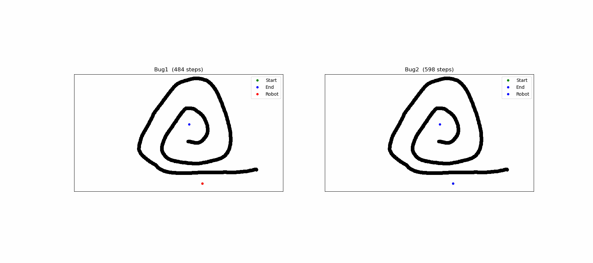
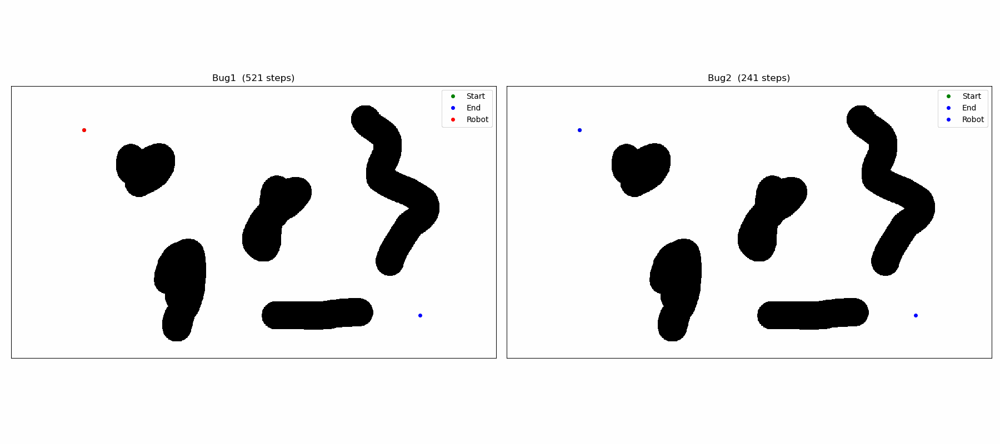
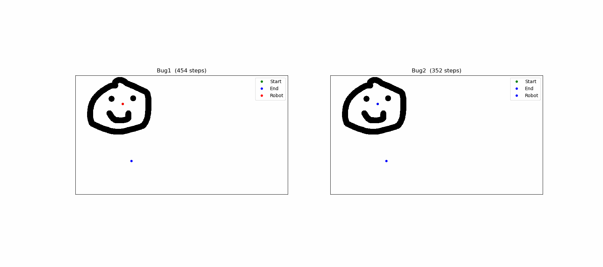

# Bug1 / Bug2 Path Planning

Simple Python project to test `Bug1` and `Bug2` on binary images.

## Install

Clone the project:

```bash
git clone https://github.com/py-Alexis/bug-path-planner.git
cd bug-path-planner
```

Install dependencies:

```bash
pip install numpy scipy matplotlib
```

## Use `bug1` and `bug2`

The main functions are in [bug.py](bug.py).

- `bug1(matrix, robot_radius, start_pose, end_pose)`
- `bug2(matrix, robot_radius, start_pose, end_pose)`

Example:

```python
from bug import bug1, bug2, Pose
from utils import image_to_binary_matrix

matrix = image_to_binary_matrix("images/Spirale.png")
start_pose = Pose(10, 10)
end_pose = Pose(150, 150)

path1 = bug1(matrix, robot_radius=10, start_pose=start_pose, end_pose=end_pose)
path2 = bug2(matrix, robot_radius=10, start_pose=start_pose, end_pose=end_pose)
```

## Use the visualization file

Run:

```bash
python3 visualization.py
```

Or with a specific image:

```bash
python3 visualization.py images/Obstacle.png
```

Behavior:
- if no image is given, the default image is `images/Spirale.png`
- you click once for the start and once for the goal
- then the script runs `Bug1` and `Bug2` and shows both paths side by side

## Examples

the gif shown here are pretty slow but the real matplotlib output is much faster and smother

### Spirale



### Obstacle



### Not possible


